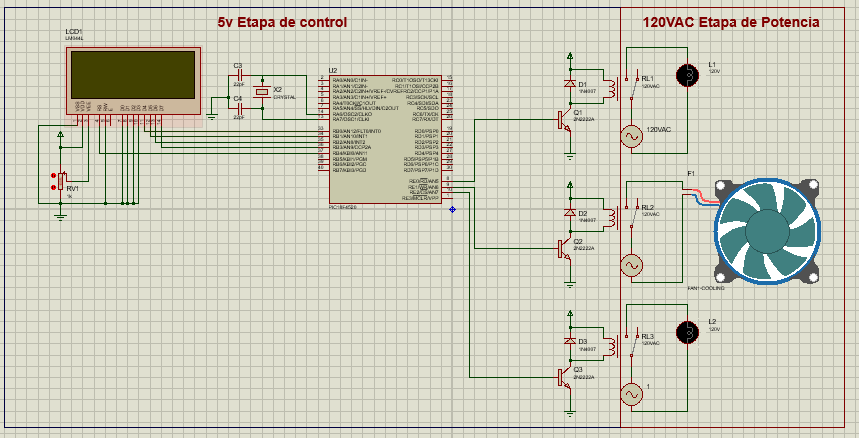
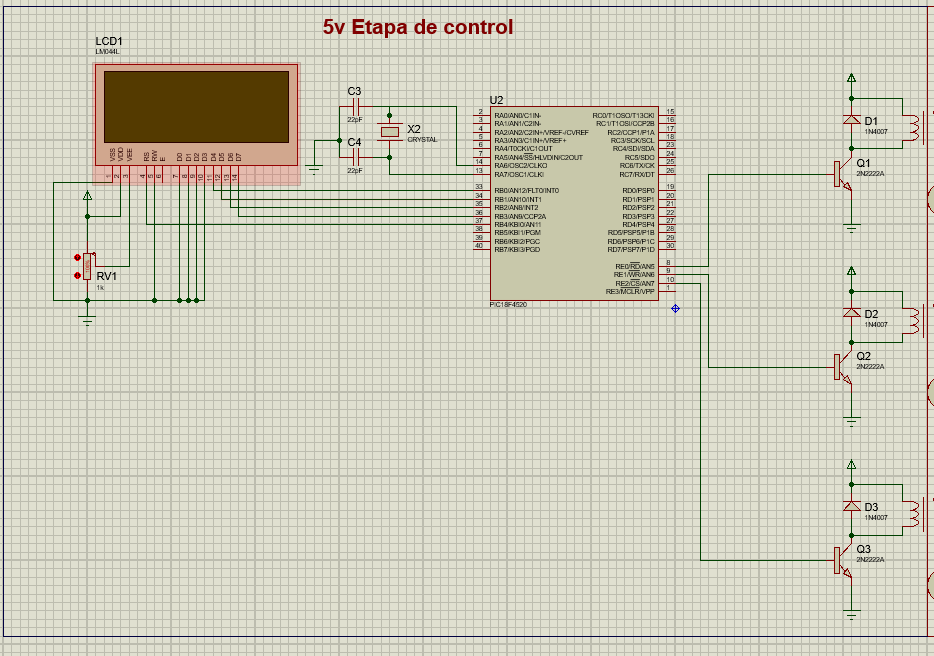
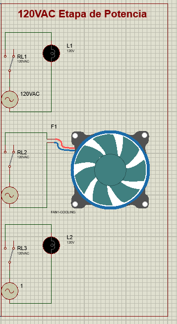

# Voluntariado_PI
# 🏠 Sistema Domótico con PIC + Bluetooth

## 📌 Descripción

Este proyecto implementa un sistema domótico básico utilizando un microcontrolador PIC, permitiendo el control de dispositivos eléctricos (focos, ventiladores, etc.) mediante una aplicación móvil vía comunicación Bluetooth.

El sistema integra hardware y software para demostrar el flujo completo de automatización: desde la interacción del usuario hasta la activación de cargas reales.

---

## 🎯 Objetivos

* Controlar dispositivos eléctricos mediante un microcontrolador
* Implementar comunicación serial (UART)
* Integrar control inalámbrico usando Bluetooth
* Visualizar estados del sistema en una pantalla LCD

---

## ⚙️ Tecnologías utilizadas

* MikroBasic (programación del PIC)
* Módulo Bluetooth (HC-05 / HC-06)
* Pantalla LCD 16x2
* Módulo Relay
* App Inventor (aplicación móvil)

---

## 🧠 Arquitectura del sistema

App móvil → Bluetooth → PIC → Relay → Dispositivo

El usuario envía un comando desde la app, el PIC lo recibe mediante UART, interpreta la instrucción y activa o desactiva una salida que controla un relay.

---

## 🔌 Componentes

* Microcontrolador PIC
* Módulo Relay
* LCD
* Módulo Bluetooth
* Fuente de alimentación

---

## 💻 Funcionamiento del código

### 📡 UART

Permite la comunicación entre la app y el microcontrolador.

* `Uart1_Init(9600)` → Inicializa la comunicación
* `Uart1_Data_Ready()` → Verifica si hay datos
* `Uart1_Read()` → Lee el comando recibido

---

### 📺 LCD

Muestra el estado del sistema en tiempo real.

* `Lcd_Init()` → Inicializa pantalla
* `lcd_cmd(_lcd_clear)` → Limpia pantalla
* `Lcd_out(fila, columna, texto)` → Muestra mensajes

---

### 🔄 Lógica del sistema

El sistema utiliza una estructura `select case` para interpretar comandos:

* 0 → Apagar todo
* 1 → Encender luz
* 2 → Encender ventilador
* 3 → Luz comedor
* 4 → Encender todo

---

## 📱 Aplicación móvil

Desarrollada en App Inventor, permite enviar comandos al PIC mediante Bluetooth utilizando botones.

---

## 🧪 Ejemplo de uso

1. El usuario abre la app
2. Se conecta al módulo Bluetooth
3. Presiona un botón
4. El PIC recibe el comando
5. Se activa un relay
6. Se actualiza el LCD

---

## 📊 Diagramas

Diagramas disponibles en la carpeta [image/](image/):

* Diagrama general

* Etapa de control

* Etapa de potencia

---

## 🚀 Posibles mejoras

* Integración con sensores (temperatura, luz)
* Automatización por horarios
* Control vía WiFi
* Interfaz más avanzada

---

## ⚠️ Consideraciones

* Manejar correctamente la etapa de potencia (110V/220V)
* Asegurar aislamiento con relays
* Verificar conexiones antes de energizar

---
## 📚 Referencias
* Documentación de PIC
* Tutoriales de Bluetooth HC-05
* Guías de App Inventor
* Ejemplos de proyectos domóticos
* [MikroBasic Documentation](https://www.mikroe.com/mikrobasic)
* [HC-05 Bluetooth Module](https://www.instructables.com/HC-05-Bluetooth-Module/)
* [App Inventor](https://appinventor.mit.edu/)
* [Microcontroller Projects](https://www.electronicsforu.com/electronics-projects/microcontroller-projects)
* [Relay Module Guide](https://www.electronicsforu.com/electronics-projects/relay-module-guide)
* [LCD Interfacing with PIC](https://www.electronicsforu.com/electronics-projects/lcd-interfacing-pic)